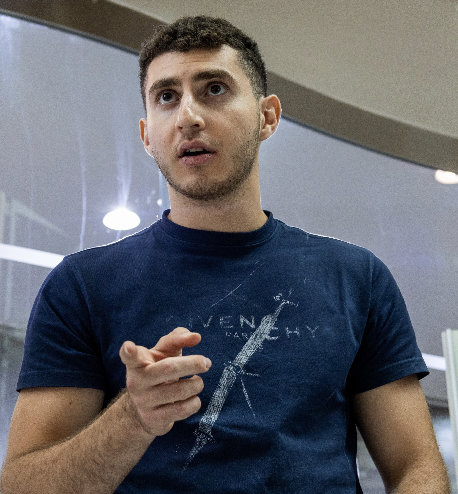

## About
Hamzeh Abu Qamar is an honors senior student, majoring in Electrical Engineering at the United Arab Emirates University. Due to his immense potential, he was granted the IEEE Undergraduate Research Scholarship & the MBZ Scholarship at NYU Abu Dhabi. Hamzeh also had the privilege of interning at KAUST, one of leading research institutions in the world. He also engaged in discussions and debates at COP28 as a Youth 4 Sustainability Ambassador. He is proactive in the community, always participating in hackathons and competitions to provide him with extracurricular skills. For graduate studies, he wishes to incorporate AI, ML, and 6G communications for sustainable applications.

## Publications
1. K. Mohammed, H. A. Qamar, R. A. Khalil and N. Saeed, "Regional CubeSat Communication
and Constellation Design Evaluation," 2023 International Conference on Microelectronics
(ICM), Abu Dhabi, United Arab Emirates, 2023, pp. 284-287, doi:10.1109/ICM60448.2023.10378915.
2. “No2Pollution: A Guide to Analyze Air Quality via Level-2 Satellite Imagery”
Under Review – EuCNC & 6G Summit, Jan. 25th , 2024
3. “Analyzing Coverage and Link Budgets in Mega-Constellations of Small Satellites”
Under Review – EuCNC & 6G Summit, Jan. 8th, 2024
4. “Probing Blood Dynamics: A Novel Piezoelectric Approach to Monitor Flow and
Detect Clot Formation” 
Under Review – Elsevier Measurement, Jan. 5th, 2024
5. “Clot Monitoring Through Electromechanical Analysis”
Presented – IEEE Conference on Systems and Control (ICSC), Dec. 21st, 2023

## Skills
• Python, AI, ML Programming

• Raspberry Pi & Arduino

• MATLAB and C++

• Public speaking, critical thinking, leadership

• Project management

## Socials
• Cisco CCNA: Introduction to Networks

• Google Project Management: Professional Certificate

• IBM Data Science (soon!)

## Socials
[LinkedIn](https://www.linkedin.com/in/hamzeh-abu-qamar-034605218/)

