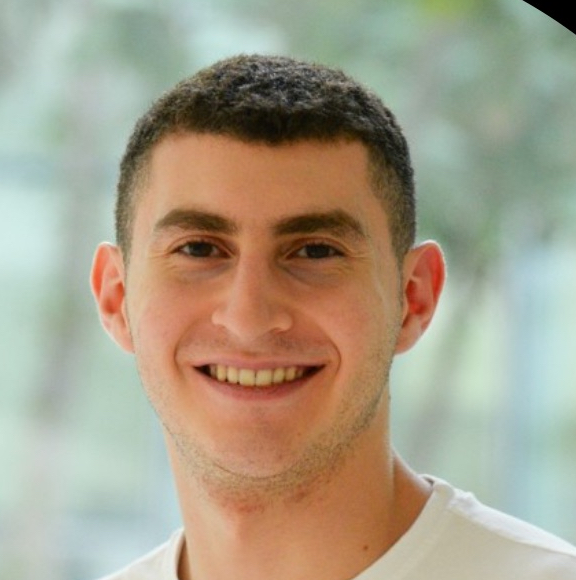
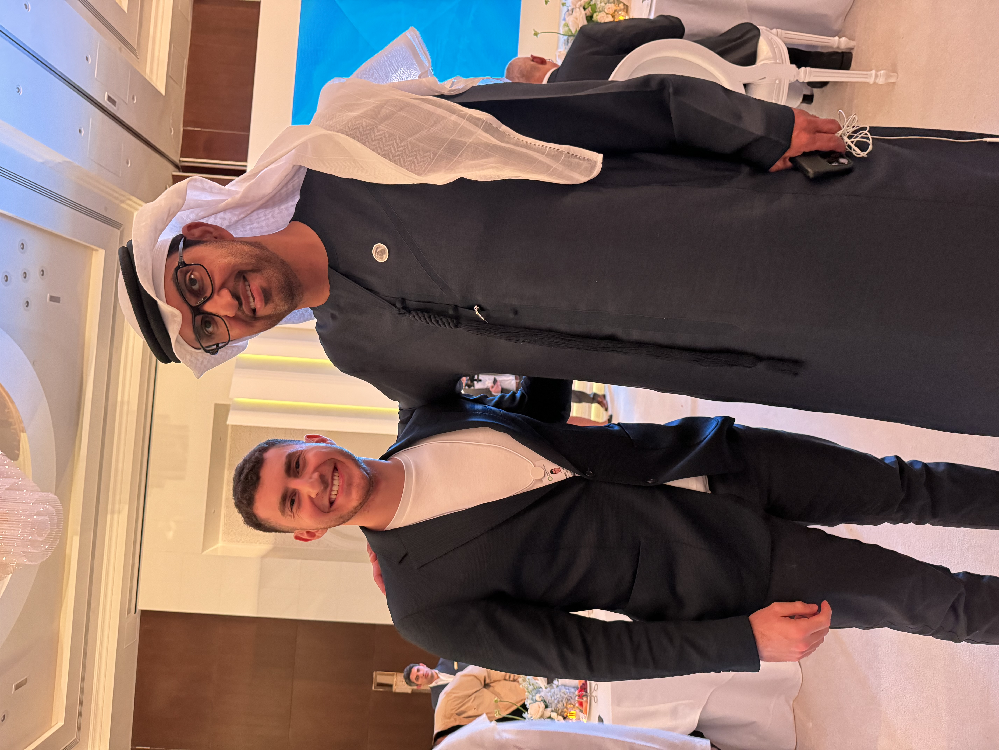
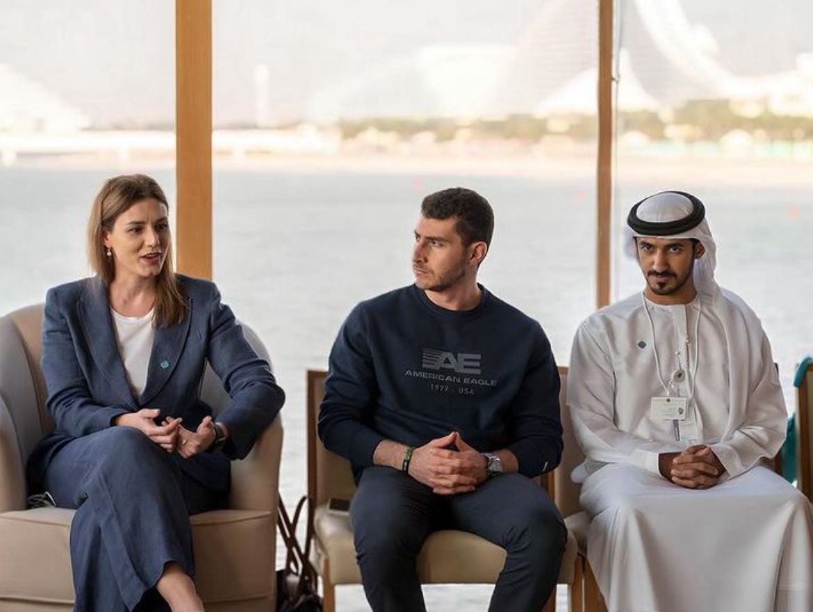
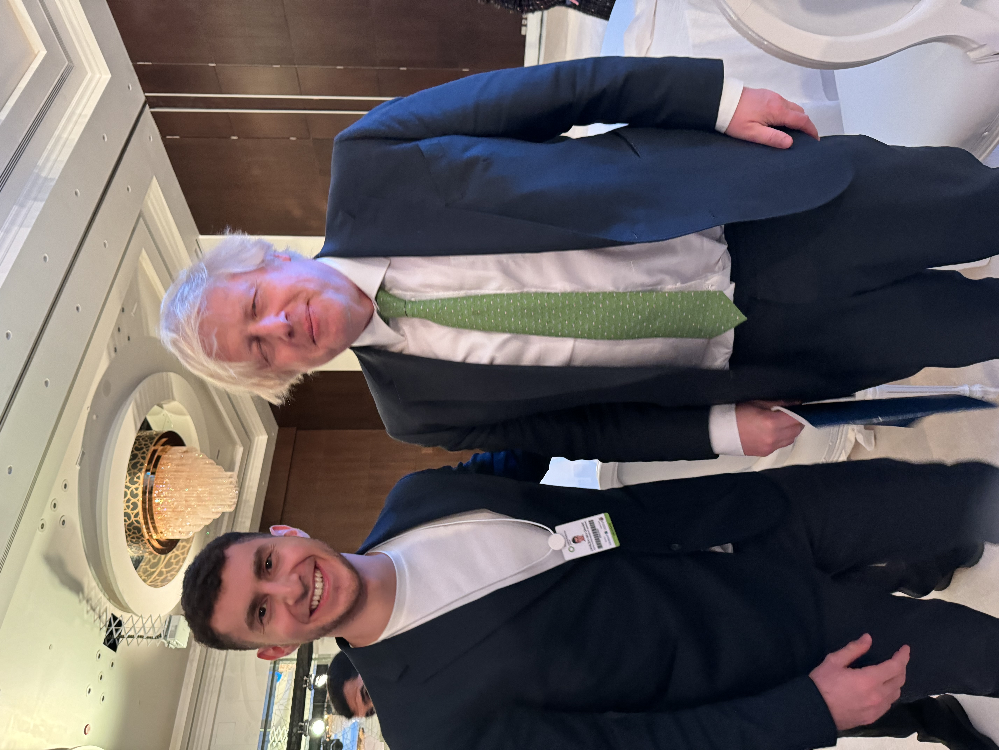
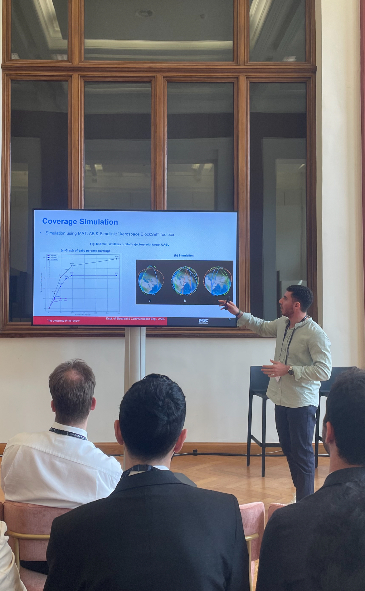
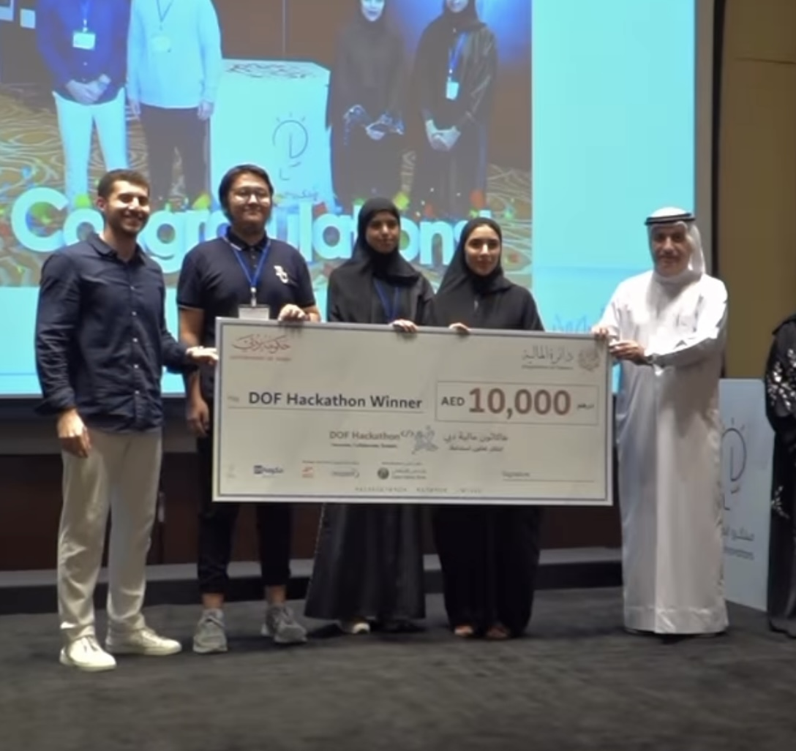
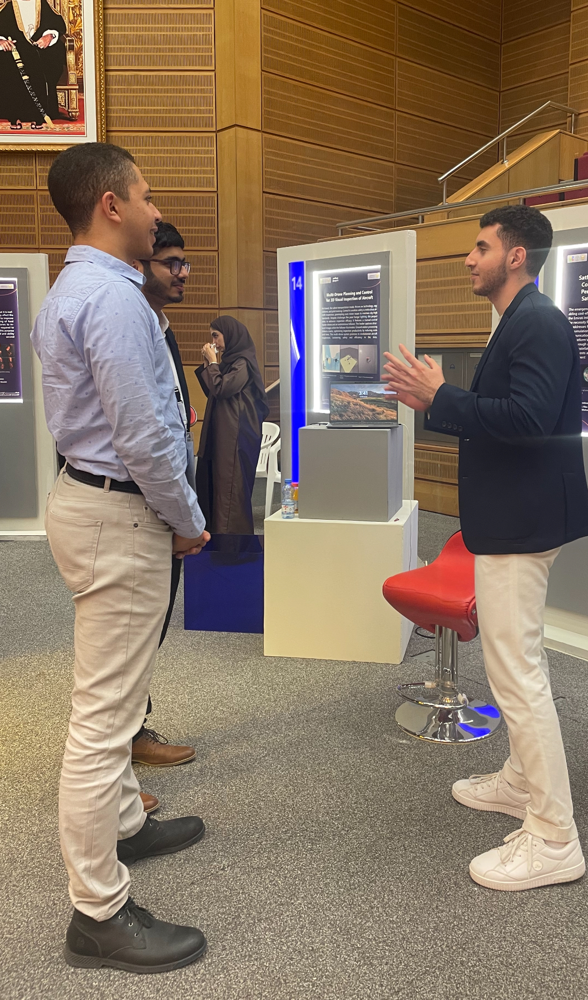
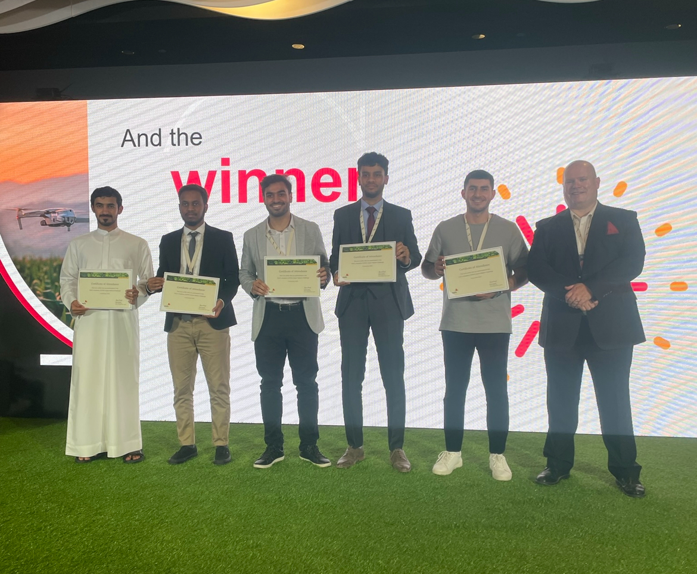
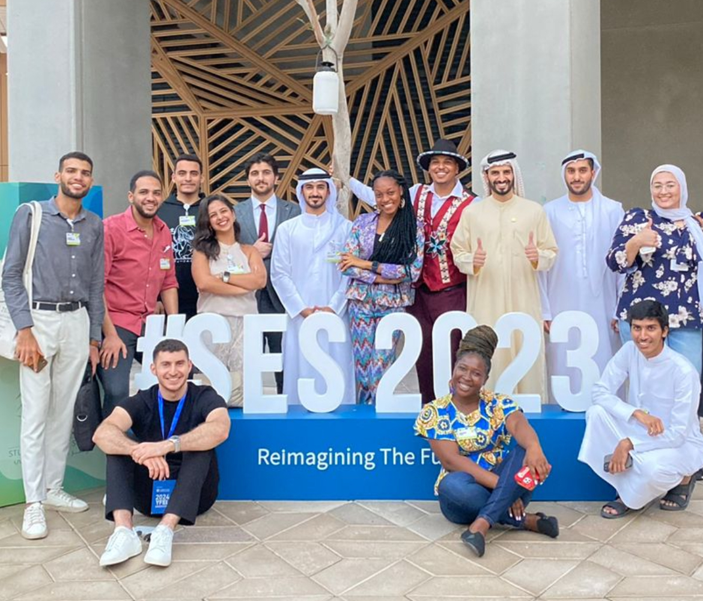

  

---

## Welcome to My Page, Enjoy!

Hamzeh Abu Qamar is an Electrical Engineering graduate currently pursuing a Master's in Technology Innovation and Entrepreneurship at KAUST. His academic excellence and innovative mindset have earned him the IEEE Undergraduate Research Scholarship and the prestigious MBZ Scholarship at NYU Abu Dhabi. A passionate advocate for sustainability, Hamzeh represented Masdar’s Youth 4 Sustainability program at COP28, actively engaging in high-level discussions on global environmental issues. As an aspiring entrepreneur, he aims to leverage AI and ML to address sustainability challenges in the GCC region.

  <a href="HamzehAbuQamarCV.pdf" style="color:#ffffff; background-color:#008793; padding:10px 15px; border-radius:5px; text-decoration:none; font-weight:bold; margin-right: 10px;">Download My CV</a>
  <a href="#gallery" style="color:#ffffff; background-color:#004d7a; padding:10px 15px; border-radius:5px; text-decoration:none; font-weight:bold; margin-right: 10px;">Go To Gallery</a>
  <a href="https://www.linkedin.com/in/hamzeh-abu-qamar-034605218/" style="color:#ffffff; background-color:#0077b5; padding:10px 15px; border-radius:5px; text-decoration:none; font-weight:bold;">LinkedIn</a>

---

## Projects

### Probing Blood Dynamics: A Novel Piezoelectric Approach to Monitor Flow and Detect Clot Formation
The paper is currently under review (major revisions) for MDPI Sensors journal publication.

### Regional CubeSat Communication and Constellation Design Evaluation
Created a simulator of small satellite constellations that will, in advance of their deployment, serve as a proactive measure to mitigate potential issues and curtail the risk of costly satellite failures. The [paper](Papers/CubeSat_IEEE%20ICM2023.pdf) has been published on IEEE Xplore.

### SatNet SpaceSim: A Platform for Performance Analysis of Small Satellites Mega-Constellations
Introduced SatNet SpaceSim, a simulator and a graphical user interface developed to analyze the performance of communication links and coverage of small satellite constellations before deployment. This aims to detect and address potential issues proactively, reducing the risk of costly satellite malfunctions. The [paper](Papers/SatNetSpaceSim_EuCNC24.pdf) has been published on IEEE Xplore.

### Clot Monitoring Through Electromechanical Analysis
Proposed a novel approach to detect the existence of a blood clot inside a vessel utilizing piezoelectric sensors. The developed model also allows us to determine the vessel radius and the velocity of the blood at different locations. The [paper](Papers/Clot%20Monitoring_IEEE%20ICSC2023.pdf) has been published on IEEE Xplore.

---

## Hackathons & Competitions

### TecShift Hackathon 2024 - Aramco & Lab7, Dhahran, Saudi Arabia
We created Solar Synergies - a blockchain platform that allows businesses to trade carbon credits. Also, using the data generated from these transactions, we 
influence government policy decisions in the form of AI-driven insights.

### Student Engineering Gathering - Sultan Qaboos University, Muscat, Oman
I presented my senior project and simulator - SatNet SpaceSim. Also, I networked with experts in Oman's tech industry.

### AI in Finance Hackathon - Dept. of Finance, Dubai, UAE
We secured first place and a 10,000 AED grant by envisioning a platform that provides & collects data on microfinancing solutions for locals. Moreover, this platform 
uses AI algorithms to reallocate government budget and expenditure. 

---

## Skills

- **Programming:** Python, AI, ML
- **Hardware:** Raspberry Pi, Arduino
- **Software:** MATLAB, C++
- **Soft Skills:** Public Speaking, Critical Thinking, Leadership
- **Business Skills:** Entrepreneurship, Project Management
- **Languages:** English, Arabic, Chinese (basic)

---

## Hobbies & Interests

- **Sports:** Bodybuilding, Soccer, Volleyball
- **Reading:** Books & forums on business, entrepreneurship, history, and politics
- **Traveling:** Experiencing life & exposure to different cultures
- **Investing:** Analyzing trends & active stock market investing

---

## Gallery

  
   Picture with HE Dr. Sultan Al Jaber, CEO of ADNOC

  
   Meeting with HE Bora Muzhaqi, Youth Minister of Albania

  
   Workshop with Boris Johnson, former PM of UK

  
   Presenting COP28 Hackathon results to HE Sara Al Amiri, Education Minister of UAE

  
   Presenting conference paper at EuCNC conference in Antwerp, Belgium

  
   Won 1st place at the Dubai Dept. of Finance's AI Hackathon

  
   Presenting research findings at the student gathering in Muscat, Oman

  
   Participated in a climate challenge with PwC at COP28

  
   Delegate at the Student Energy Summit at New York University Abu Dhabi

---

Last Updated: Sept. 1st, 2024

