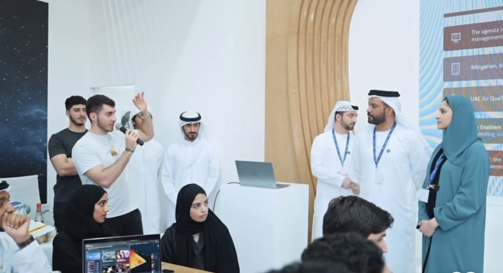

  

---

## Welcome to My Page, Enjoy!

Hamzeh Abu Qamar is an Electrical Engineering graduate currently pursuing a Master's in Technology Innovation and Entrepreneurship at KAUST. His dedication to innovation and sustainability has earned him prestigious opportunities, including the IEEE Undergraduate Research Scholarship, the Mohamed Bin Zayed Scholarship at NYU Abu Dhabi, and participation in COP28 and Masdar’s Youth 4 Sustainability program.
  
Now, as an aspiring entrepreneur, Hamzeh is channeling his expertise into AirGo—a climate solutions company pioneering sustainable technologies. (More details below.)

  <a href="HamzehAbuQamarCV.pdf" style="color:#ffffff; background-color:#008793; padding:10px 15px; border-radius:5px; text-decoration:none; font-weight:bold; margin-right: 10px;">Download My CV</a>
  <a href="#gallery" style="color:#ffffff; background-color:#004d7a; padding:10px 15px; border-radius:5px; text-decoration:none; font-weight:bold; margin-right: 10px;">Go To Gallery</a>
  <a href="https://www.linkedin.com/in/hamzeh-abu-qamar-034605218/" style="color:#ffffff; background-color:#0077b5; padding:10px 15px; border-radius:5px; text-decoration:none; font-weight:bold;">LinkedIn</a>

---

## Projects

### AirGo: Climate Solutions Startup
We have developed an air quality monitoring prototype with Prof. Khaled Salama.

Currently, we are currently looking to validate the product with potential customers before startup incubation at [Shenzhen InnoX Academy](https://en.innoxsz.com/) in June 2025.

Navigate to our website: [AirGo Website](https://airgo.live)

### Blood Flow Detection Using Piezoelectric Sensors
Proposed a novel approach to detect the existence of a blood clot inside a vessel utilizing piezoelectric sensors.. Conducted experiments around an artificial blood vessel to investigate the behavior of blood velocity & pressure in the presence of a clot.

[Blood Flow Detection Using Piezoelectric Sensors](https://ieeexplore.ieee.org/document/10810278/metrics#metrics) has been published on IEEE Sensors journal.

[Clot Monitoring Through Electromechanical Analysis](https://ieeexplore.ieee.org/document/10449743) has been presented in the 11th IEEE International Conference on Systems and Control (ICSC) in Sousse, Tunisia and published on IEEE Xplore.

### CubeSat Communication 
Created a simulator & GUI to analyze the performance of communication links and coverage of small satellite constellations before deployment. This aims to detect and address potential issues proactively, reducing the risk of costly satellite malfunctions. 

[Regional CubeSat Communication & Constellation Design Evaluation](https://ieeexplore.ieee.org/abstract/document/10378915) has been presented in the 2023 International Conference on Microelectronics (ICM) in Abu Dhabi, UAE and published on IEEE Xplore.

[SatNet SpaceSim: A Platform for Performance Analysis of Small Satellites Mega-Constellations](https://ieeexplore.ieee.org/stamp/stamp.jsp?arnumber=10597066) has been presented in the 2024 EuCNC/6G Summit in Antwerp, Belgium and published on IEEE Xplore.

---

## Hackathons & Competitions

### International Business Plan Competition 2025 - University of Illinois Urbana-Champaign hosted in Austin, Texas
We founded startup “TagAlong” – system that uses powerbanks to charge EV semi trucks while on the move. Also, we performed a detailed revenue model, cost structure, feasibility study.

### TecShift Hackathon 2024 - Aramco & Lab7, Dhahran, Saudi Arabia
We created Solar Synergies - a blockchain platform that allows businesses to trade carbon credits. Also, using the data generated from these transactions, we 
influence government policy decisions in the form of AI-driven insights.

### Student Engineering Gathering - Sultan Qaboos University, Muscat, Oman
I presented my senior project and simulator - SatNet SpaceSim. Also, I networked with experts in Oman's tech industry.

### AI in Finance Hackathon - Dept. of Finance, Dubai, UAE
We secured first place and a 10,000 AED grant by envisioning a platform that provides & collects data on microfinancing solutions for locals. Moreover, this platform 
uses AI algorithms to reallocate government budget and expenditure. 

### Youth Sustainability Hackathon - General Electric, Dubai, UAE
We secured third place by solving energy transition challenges tied to UAE’s Zero Net Emissions by 2050. By devising
an energy mix plan, we were able to add 60GW renewable power to UAE’s grid.

### Pioneers 4.0 Hackathon - Lipton Teas & Infusions, Abu Dhabi, UAE
For 3 days, we tried to understand key logistics challenges Lipton faces. To solve this issue, we proposed a metaheuristics model to optimize real-world factory challenge: silos, lines, warehouse.

---

## Skills

- **Programming:** Python, AI, ML
- **Hardware:** Raspberry Pi, Arduino
- **Software:** MATLAB, C++
- **Soft Skills:** Public Speaking, Critical Thinking, Leadership
- **Business Skills:** Entrepreneurship, Project Management
- **Languages:** English, Arabic, Chinese (basic)

---

## Hobbies & Interests

- **Sports:** Bodybuilding, Soccer, Volleyball
- **Reading:** Books & forums on business, entrepreneurship, history, and politics
- **Traveling:** Experiencing life & exposure to different cultures
- **Investing:** Analyzing trends & active stock market investing

---

## Gallery

  
   Picture with HE Dr. Sultan Al Jaber, CEO of ADNOC

  
   Meeting with HE Bora Muzhaqi, Youth Minister of Albania

  
   Workshop with Boris Johnson, former PM of UK

  
   Presenting COP28 Hackathon results to HE Sara Al Amiri, Education Minister of UAE

  
   Presenting conference paper at EuCNC conference in Antwerp, Belgium

  
   Won 1st place at the Dubai Dept. of Finance's AI Hackathon

  
   Presenting research findings at the student gathering in Muscat, Oman

  
   Participated in a climate challenge with PwC at COP28

  
   Delegate at the Student Energy Summit at New York University Abu Dhabi

---

 Last Updated: March 1st, 2025

